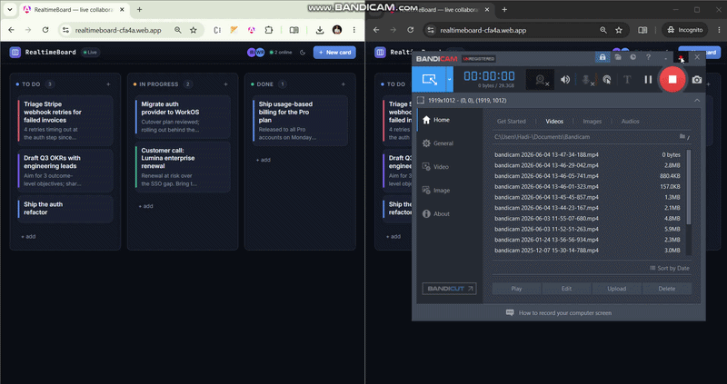

# RealtimeBoard — live collaborative kanban

[](https://github.com/Hadi-AlKammouni/realtimeboard/actions/workflows/ci.yml)
[](LICENSE)

> A live kanban board where every change syncs across all connected users in **under a second**, no refresh. Built with **Angular standalone components** and **Firebase Realtime Database** — the same real-time architecture I used in production.



**Live demo:** _Set after first deploy — see `04_GITHUB_DEPLOYMENT_RUNBOOK` step F._
**Open two tabs** to the live URL and you'll see the demo's headline feature: every card move appears instantly in both tabs.

---

## What this demonstrates

- **Real-time data synchronization** — `onValue` subscriptions over Firebase RTDB push every card and presence change to every connected client.
- **Angular standalone architecture (v21)** — zoneless change detection, `@if`/`@for` control flow, signal-based state, `provideAnimationsAsync()`.
- **Drag-and-drop with the Angular CDK** — column-to-column moves with proper accessibility (keyboard reachable, ARIA labels, drop-target outline).
- **Presence** — anonymous Firebase auth + `onDisconnect()` automatically removes a user when their tab closes.
- **Test automation** — Playwright E2E (add, drag, cross-context sync) running in GitHub Actions.

---

## Features

- 3 columns: **To Do / In Progress / Done**
- Add / edit / delete cards with a title, optional description, and one of 6 label colors
- Drag-and-drop between columns; order is persisted
- Presence indicator with online count + animated avatars
- Connection status pill (Live / Reconnecting) reading `.info/connected`
- Anonymous Firebase auth so the live demo needs zero sign-up
- Dark theme by default, with a working light-mode toggle (preferred theme persists in `localStorage`)
- Fully responsive: 3 columns at desktop widths, single column on mobile

---

## How the real-time layer works

Every client subscribes to `/boards/demoBoard/cards` and `/boards/demoBoard/presence` via Firebase RTDB. Local mutations call `push()` / `update()` directly — the listener echoes the write back as an `onValue` event, which feeds an Angular signal, which re-renders the UI. Because everyone listens to the same path, every write fans out to every connected client within ~tens of milliseconds. Card reordering is done in **one batched `update()`** so concurrent listeners see one consistent state.

Presence uses Firebase's `onDisconnect` hook: when the WebSocket drops, the server removes the user's presence row, so closing a tab updates the online list everywhere within a second.

---

## Tech stack

- **Angular 21** (standalone components, signals, zoneless)
- **Firebase Realtime Database** + **Anonymous Auth** (free Spark tier)
- **Angular CDK Drag & Drop**
- **Playwright** for E2E tests
- **GitHub Actions** for CI
- **Firebase Hosting** for deploy

---

## Setup (local)

1. **Clone & install**
   ```bash
   git clone https://github.com/Hadi-AlKammouni/realtimeboard.git
   cd realtimeboard
   npm install
   ```

2. **Create a Firebase project** (free Spark tier)
   - Go to <https://console.firebase.google.com> → **Add project**
   - In the project, enable:
     - **Authentication → Sign-in method → Anonymous** → Enable
     - **Realtime Database** → Create database → Start in production mode
   - Open the local `database.rules.json` and paste it into **Realtime Database → Rules → Publish** (it scopes anonymous read/write to `/boards/demoBoard`)
   - **Project settings → General → Your apps → Web (`</>`)** → register the app and copy the SDK config.

3. **Add your Firebase config**
   ```bash
   cp src/environments/environment.example.ts src/environments/environment.ts
   ```
   Then paste your config values into `environment.ts` (already in `.gitignore`).
   Required keys: `apiKey`, `authDomain`, `databaseURL`, `projectId`, `storageBucket`, `messagingSenderId`, `appId`.

4. **Run**
   ```bash
   npm start
   ```
   Open <http://localhost:4200> — and a second window to see the sync.

---

## Testing

```bash
# Unit smoke tests (vitest)
npm run test:unit

# E2E (Playwright). First run installs browsers.
npm run e2e:install
npm test

# Run the cross-context realtime sync test (needs a real Firebase config)
RTDB_LIVE=1 npm test
```

The three Playwright specs in `e2e/board.spec.ts` cover:
1. Adding a card → it appears in **To Do**.
2. Dragging a card from **To Do** → **Done** updates its column.
3. **Cross-context sync** — a card added in one browser context appears in another within 2 s.

---

## Deploy (Firebase Hosting)

```bash
npm i -g firebase-tools
firebase login
firebase use --add        # link to your project
firebase deploy --only hosting,database
```

The `firebase.json` is already configured for SPA fallback and long-cache static assets, and `database.rules.json` is published alongside the hosted build.

---

## Project structure

```
src/
  app/
    components/
      board/          board orchestrator + edit modal mount point
      card/           single card view
      card-editor/    add/edit modal
      column/         column with CDK drop list
      presence/       avatar chips + online count
      top-bar/        brand + presence + new-card + theme toggle
    models/           card.model.ts (Card, Presence, ColumnId, COLUMNS, LABEL_COLORS)
    services/
      firebase.service.ts   FirebaseApp + Auth + Database singleton
      board.store.ts        signal-based store with RTDB subscriptions
      seed.data.ts          believable demo cards loaded once on an empty board
    styles/           _tokens.scss, _reset.scss (shared with sibling projects)
  environments/
    environment.example.ts  committed, placeholder
    environment.ts          gitignored, real Firebase config
e2e/                  Playwright specs
database.rules.json   RTDB security rules
firebase.json         Firebase Hosting + Database deploy config
```

---

## License

MIT © Hadi Al Kammouni
